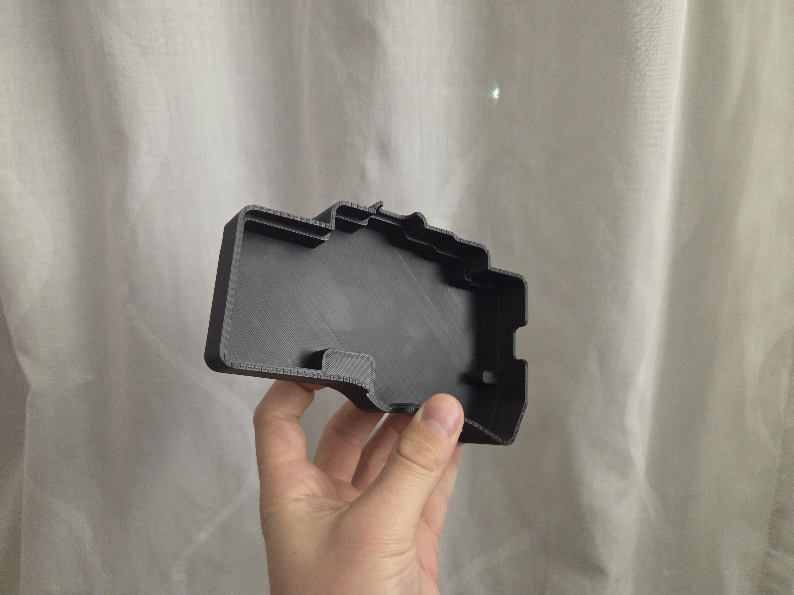

# My Custom Cantor Pro LP Wireless Keyboard

This repository contains all the files and configuration for my personal build of the **Cantor Pro LP**, a 40% low-profile, hotswap, split ergonomic keyboard. This build is fully wireless, using Nice!Nano controllers running the ZMK firmware.

## Table of Contents

- [Hardware Components](#hardware-components)
- [PCB](#pcb)
- [Firmware (ZMK)](#firmware-zmk)
- [3D Printed Case](#3d-printed-case)
- [Build Notes](#build-notes)
- [Acknowledgements](#acknowledgements)

---

## Hardware Components

| Component | Item | Notes |
| :--- | :--- | :--- |
| **Keyboard Kit** | PCBs ordered from JLCPCB but | A kit can be sorced from 42. Keebs: [Cantor Pro LP Kit](https://42keebs.eu/shop/kits/pro-micro-based/cantor-pro-lp-40-low-profile-hotswap-split-ergo-kit/) |
| **Small Electronics** | 2x Push Button 6x2mm & 42x Kailh Choc V1 Hotswap Sockets | Ordered from aliExpress, not needed when buying a Kit |
| **Small Case Parts**| 4x M3 Heat insert, 4x M3 Screw | needed for securing PCB to case |
| **Controllers** | 2x Nice!Nano v2 (or alternative) | For wireless connectivity via Bluetooth. |
| **Batteries** | 2x 102050 LiPo (1000mAh) | One for each half. Fits perfectly with the custom case. |
| **Switches** | 42x Kailh Choc V1  | in my case: Sunset, waiting for sunrise |
| **Keycaps** | 42x Choc V1 Keycaps` | e.g., MBK Blank Choc Keycaps. |
| **Case** | Custom 3D Printed Case & Cover | Files are located in the `/case` directory. |

---
## PCB
The 42 Keebs Cantor was remixed to change the text of the keyboard and understand the layers. 
The Files are located in the `/pcb/` directory. 

## Firmware (ZMK)

This keyboard runs on the [ZMK Firmware](https://zmk.dev/docs), which is designed for wireless keyboards. 

### My Configuration

* **ZMK Config:** The main configuration files are located in the `/config/` directory.

### Configure, Build & Flash
* Configuration: Done using awesome [Keymap Editor](https://nickcoutsos.github.io/keymap-editor/)
* Build: standard Github Actions
* Flash: To Flash consult Microcontroller Documentation

---

## 3D Printed Case

This build uses a custom-designed 3D printed case and a friction fit travel cover to protect the keys.
It was built in Fusion360 and source files, as well as Step files are shared. (because STL sucks)
* **Files Location:** `/case`

Only one side is provided. To print the other half, mirror the files in the slicer. 

### Recommended Print Settings

* **Material:** Any, preferabbly in ABS/ASA/PETG due to better heat resistance
* **Outer Walls:** minimum of 3
* **Layer Height:** 0.2mm
* **Infill:** 15-20%
* **Supports:** Not required

---

## Build Notes

* **Fully Wireless:** This build is fully wireless and does **not** use a TRRS cable. The two halves communicate via Bluetooth. The TRRS jacks on the PCB are not installed.
* **Battery Placement:** The batteries are not placed underneath the controllers. They are placed under in the Case. Due to tight tolerances, trim the PCB pins flush
* **Pin Difficultys using NiceNano:** Due to the design of the PCB, when using the NiceNano, the 101 Pin has to be connected to the bottom row at an angle. Also on the right side of the keyboard, the left thumb key and the 5. key in Row 3 are swapped in the keymap. 

---

## Acknowledgements

* **Cantor Keyboard:** Diego Palacios
* **Cantor Pro LP Kit:** [42. Keebs](https://42keebs.eu/)
* **ZMK Firmware:** The ZMK contributors.
